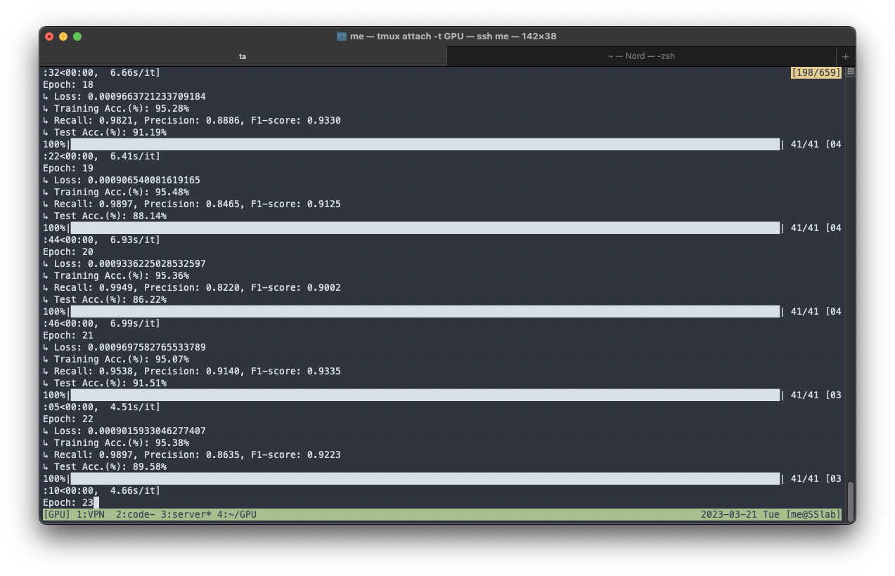
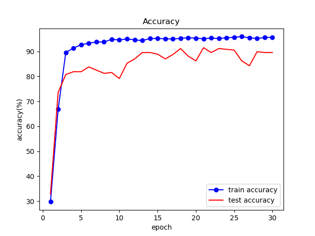
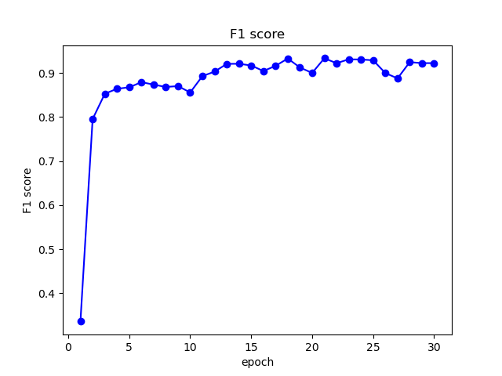
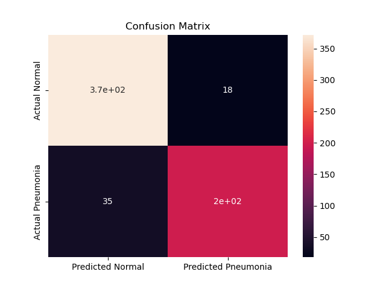
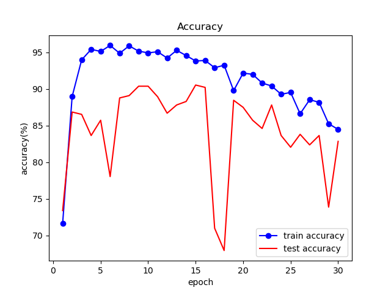
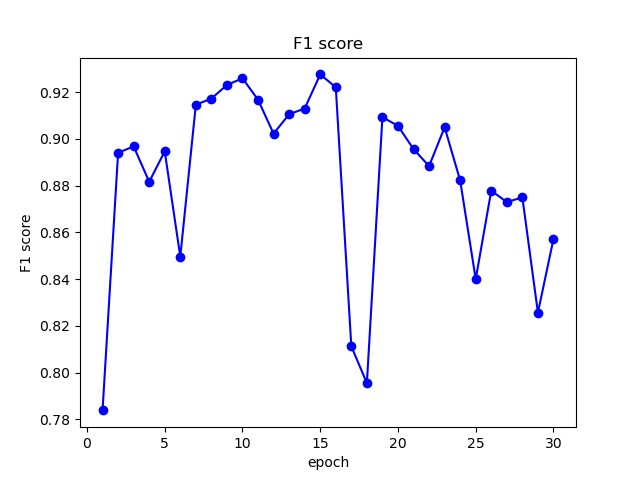
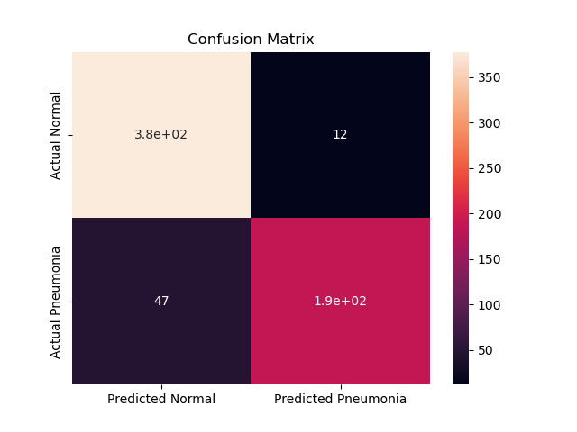

# AIMI LAB1
contributed by < `huang-me` >

# Introduction
Artificial Intelligence is now frequently used in Medical Imaging in order to reduce the workload of doctors. A well trained model can help doctors find disease in short calculation time.

In this lab, we're building a model to classfy pneumonia and normal case using deep learning approach. Given the X-ray image of the patient, the model would tell whether the patient of the image seems to have pneumonia.

# Experiment setups
- The detail of your model  
    - Use pretrained ResNet18 and ResNet50 model by torchvision module.
- The detail of your Dataloader(data augmentation)  
    - I use `DataLoader` of `toch.utils.data` with shuffle.

|  Model   | Learning rate | batch size |
|:--------:|:-------------:|:----------:|
| ResNet18 |  $1*10^{-5}$  |    128     |
| ResNet50 |  $1*10^{-5}$  |     64     |

# Experimental result
- Highest testing accuracy and F1-score (screenshot)
    
    > The highest accuracy of ResNet18 is $91.51\%$ and the F1-score is $0.9335$ in **epoch 21**.
- Ploting the comparison figure
    - ResNet18
        - Training and testing accuracy curve  
            
        - Testing F1-score curve  
            
        - Highest testing accuracy heatmap  
            
    - ResNet50
        - Training and testing accuracy curve  
            
        - Testing F1-score curve  
            
        - Highest testing accuracy heatmap  
            
# Discussion
- Eventhough ResNet50 have more parameter, it didn't have better accuracy. Therefore, we can say that the number of parameters doesn't always have positive relation to the accuracy of result.
- Overfitting occured is ResNet50, the accuracy of ResNet50 in epoch 30 is worse than it in epoch 10.

# GitHub link
https://github.com/huang-me/AI_for_medical_image
